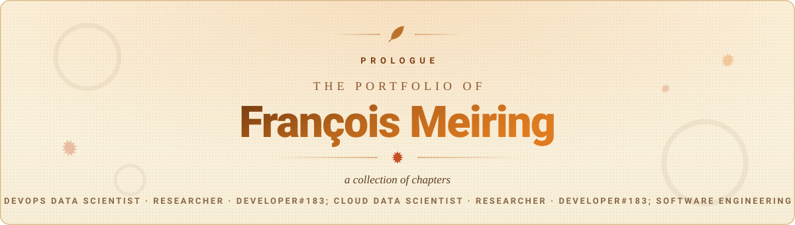

<!-- Palette and layout mirror the live site (frontend/src/styles/tokens.css).
     GitHub strips style/class/inline <svg> from markdown, so the brand comes
     from committed SVGs, <picture> theme switching, and hex-coloured badges.
     Content is the same data the site renders from Firestore, so keep them in step.
     Every graphic here is generated by .github/workflows/contribution-snake.yml
     and committed to the `output` branch, so no third-party card service can
     take them down. They are *served* over jsDelivr, which is a CDN in front of
     this repo rather than a service that renders anything. -->

<!-- The contribution snake, generated daily by
     .github/workflows/contribution-snake.yml and committed to the `output`
     branch. Served over jsDelivr rather than raw.githubusercontent.com: the
     latter answers 503 "Backend.max_conn reached" from the Johannesburg edge,
     which is precisely where these get read from. -->

  <picture>
    <source media="(prefers-color-scheme: dark)" srcset="https://cdn.jsdelivr.net/gh/Francois0203/Francois0203@output/snake-dark.svg">
    <source media="(prefers-color-scheme: light)" srcset="https://cdn.jsdelivr.net/gh/Francois0203/Francois0203@output/snake-light.svg">
    
  </picture>

  <picture>
    <source media="(prefers-color-scheme: dark)" srcset="./.github/assets/banner-dark.svg">
    
  </picture>

  

  
  
  
  
  
  

  
  
  

---

## About

I work on the side of software that gets it into production and keeps it running: **containers, CI/CD pipelines and the cloud** underneath them.

In my previous role I was one of two developers who built three enterprise systems from nothing and took them to production on **Docker and Kubernetes**, with GitHub CI/CD, Nginx, PostgreSQL, Redis and MinIO behind them. At **Shareforce** I work on a Django platform deployed across **Heroku and AWS**, including the pipelines it ships through.

I am working through the **AWS certifications**, from Cloud Practitioner toward DevOps Engineer Professional, and alongside the job I am reading for an **MSc in Computer Science** on distributed computing for astronomical data processing.

Away from the keyboard you will find me at the gym, on the squash court, on a hiking trail, or working through a guitar piece.

<table>
<tr>
<td width="50%" valign="top">

**Currently**

Junior Software Developer at Shareforce (Pty) Ltd
 Django platform on Heroku and AWS
 AWS Certified Cloud Practitioner exam booked
 MSc. Computer Science at North-West University

</td>
<td width="50%" valign="top">

**Focus areas**

CI/CD &middot; containers &middot; Kubernetes
 AWS &middot; reliability &middot; distributed systems

</td>
</tr>
</table>

---

## Experience

| Period | Role | Organisation |
|:--|:--|:--|
| `May 2026 - Present` | **Junior Software Developer** | **Shareforce (Pty) Ltd** &nbsp;Melrose Arch, Johannesburg |
| `Jan 2025 - Apr 2026` | **Full Stack Software Developer** | **Aquatico Scientific** &nbsp;Centurion, South Africa |
| `Matric year` | Shop Assistant | Western Rackets |
| `Matric year` | Waiter | Bean Tree, Krugersdorp |

<b>Shareforce (Pty) Ltd</b>, Junior Software Developer &nbsp; May 2026 to Present

 

Working on the core equity management platform within a structured team of senior, intermediate, and junior developers.

- **Delivery.** The deployment pipelines the platform ships through, across Heroku and AWS.
- **Platform work.** System refactor, design decisions on new features, and defect resolution against production.
- **Automation.** Building AI tooling into parts of the internal workflow.
- **Modelling and reporting.** Predictive modelling for cap tables, a new project for the company, plus TM1 and accounting reports.

**Stack.** Django and PostgreSQL, with Redis for caching, deployed across Heroku and AWS.

Working alongside more senior developers, on a platform older than my career, has done more for how I structure and test my work than anything I have built alone.

<b>Aquatico Scientific</b>, Full Stack Software Developer &nbsp; Jan 2025 to Apr 2026

 

Replaced the whole of the company's operational software over sixteen months, as one of two developers on the project. Three systems, all built new:

- **Employee Management System**
- **Laboratory Management System**
- **Project Management System**

**Architecture.** One shared repository of microservices rather than three separate products, with **email**, **label printing** and **quoting** each broken out as its own service. A **React component library published as an npm package** kept every screen across the estate visually one system.

**Stack.** React on the frontend and Node.js on the backend, with PostgreSQL as the primary database and Redis for caching. Object storage through MinIO; source control and CI/CD on GitHub. Containerised with Docker and orchestrated on Kubernetes in production.

Building at that scale with no senior engineer above us taught me the cost of decisions I was not yet experienced enough to recognise as decisions.

---

## Education

| Period | Qualification | Institution |
|:--|:--|:--|
| `2026 - Present` | **MSc. Computer Science** | North-West University, Potchefstroom |
| `2024` | **BSc. Hons. Computer Science** | North-West University, Potchefstroom |
| `2021 - 2023` | **BSc. Computer Science &amp; Statistics** | North-West University, Potchefstroom |
| `Completed` | National Senior Certificate (Matric) | Ho&euml;rskool Noordheuwel |

Detail on each qualification

 

- **MSc. Computer Science.** Research-focused master's degree on astronomical data processing and the distributed computing systems it runs on.
- **BSc. Hons. Computer Science.** Honours degree specialising in advanced software engineering and computational research methodologies.
- **BSc. Computer Science &amp; Statistics.** Dual-major undergraduate degree combining computational theory with statistical analysis and data science fundamentals.
- **National Senior Certificate.** Physics, Afrikaans Home Language, English First Additional Language, Mathematics, Information Technology, Computer Applications Technology.

---

## Certifications

**AWS path.** As each exam is passed, its row gets the verified Credly badge.

| Credential | Exam | Level | Status |
|:--|:--|:--|:--|
| **AWS Certified Cloud Practitioner** | `CLF-C02` | Foundational | Exam booked |
| **AWS Certified Solutions Architect - Associate** | `SAA-C03` | Associate | Planned |
| **AWS Certified CloudOps Engineer - Associate** | `SOA-C03` | Associate | Planned |
| **AWS Certified Developer - Associate** | `DVA-C02` | Associate | Planned |
| **AWS Certified DevOps Engineer - Professional** | `DOP-C02` | Professional | Planned |

Other certifications

 

- **NAUI Open Water Scuba Diver**, National Association of Underwater Instructors, `Jun 2026`, does not expire.
- **Fire Marshal**, AETA Training Solutions, `Aug 2026`, valid to `Aug 2028`. Basic firefighting.

---

## Technical Skills

<table>
<tr>
<td valign="top" width="33%">

**Cloud &amp; Platform**

</td>
<td valign="top" width="34%">

**Delivery &amp; Building**

</td>
<td valign="top" width="33%">

**Professional**

</td>
</tr>
</table>

---

## Contribution Activity

<!-- Animated SVGs generated in this repo and committed to the `output` branch,
     so they play as the README loads and cannot break when someone else's free
     tier runs out. The snake from the same set is at the top of the page. -->

  <picture>
    <source media="(prefers-color-scheme: dark)" srcset="https://cdn.jsdelivr.net/gh/Francois0203/Francois0203@output/activity-dark.svg">
    <source media="(prefers-color-scheme: light)" srcset="https://cdn.jsdelivr.net/gh/Francois0203/Francois0203@output/activity-light.svg">
    
  </picture>

  <picture>
    <source media="(prefers-color-scheme: dark)" srcset="https://cdn.jsdelivr.net/gh/Francois0203/Francois0203@output/stats-dark.svg">
    <source media="(prefers-color-scheme: light)" srcset="https://cdn.jsdelivr.net/gh/Francois0203/Francois0203@output/stats-light.svg">
    
  </picture>

---

## Selected Work

| Project | What it is |
|:--|:--|
| **[Telescope-Correlator](https://github.com/Francois0203/Telescope-Correlator)** | Signal correlation for telescope array data, the engineering side of the MSc research into distributed astronomical data processing. |
| **[Nutrition-AI](https://github.com/Francois0203/Nutrition-AI)** | Applied machine learning over nutritional data. |
| **[Francois0203](https://github.com/Francois0203/Francois0203)** | This profile, and the React and Firebase portfolio that feeds it, deployed and kept in sync by GitHub Actions. |

The full project list, pulled straight from GitHub with READMEs rendered in-page, lives at **[francois-portfolio.web.app/projects](https://francois-portfolio.web.app/projects)**.

---

## Get in touch

Open to **DevOps, cloud and platform engineering** roles.

  
  
  

  DevOps &nbsp;&middot;&nbsp; Cloud &nbsp;&middot;&nbsp; CI/CD &nbsp;&middot;&nbsp; Distributed Systems

